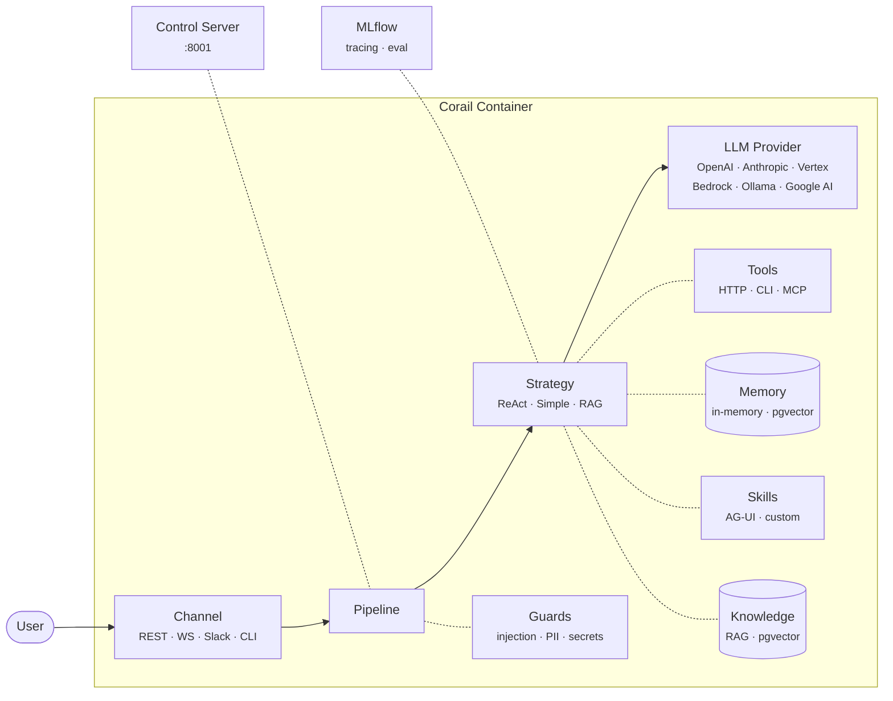

<div align="center">

# Corail

**Autonomous agent runtime for the [Récif](https://github.com/recif-platform) platform.**

Each agent runs as its own container — with its own model, tools, memory, and skills.
Like corals growing independently on a reef.


[](https://discord.gg/P279TT4ZCp)

</div>

> **⚠️ Alpha Release** — Récif has just been open-sourced. The platform is functional but expect rough edges, breaking changes, and evolving APIs. We're actively looking for **contributors** — whether you're into Go, Python, Kubernetes, React, or AI/ML. Come shape the future of agent operations with us.
>
> **[Join us on Discord →](https://discord.gg/P279TT4ZCp)** · **[Documentation →](https://recif-platform.github.io/docs/introduction)**

---

## Table of Contents

- [Overview](#overview)
- [Architecture](#architecture)
- [Quick Start](#quick-start)
- [Configuration](#configuration)
- [LLM Providers](#llm-providers)
- [Strategies](#strategies)
- [Channels](#channels)
- [Tools & Skills](#tools--skills)
- [Guards](#guards)
- [Evaluation](#evaluation)
- [Knowledge Base (RAG)](#knowledge-base-rag)
- [Control Plane](#control-plane)
- [Development](#development)
- [Contributing](#contributing)
- [License](#license)

---

## Overview

Corail is the Python runtime that powers every agent in the Recif platform. It handles the full lifecycle: receiving user input through a **channel**, running it through a **strategy** backed by an **LLM provider**, optionally calling **tools**, persisting **memory**, and streaming the response back — all inside a single container.

Key capabilities:

- **7 LLM providers** — OpenAI, Anthropic, Google AI, Vertex AI, Ollama, AWS Bedrock, Stub (registry pattern, lazy loading)
- **Multi-channel I/O** — REST API, WebSocket, Slack, Google Chat, CLI
- **Reasoning strategies** — ReAct (tool-calling loop), Simple (single-turn), RAG (retrieval-augmented)
- **Built-in guards** — Prompt injection detection, PII masking, secret/credential blocking
- **AG-UI** — Agents produce rich structured content (charts, tables, code blocks), not just text
- **SSE streaming** — Real-time token streaming with thinking block support
- **MLflow integration** — Tracing, auto-logging, and 14 evaluation scorers
- **MCP tool support** — Model Context Protocol for interoperable tool definitions
- **Control plane** — Dedicated control server for platform integration on port 8001

---

## Architecture

```
corail/
├── models/        # LLM providers (factory + registry, lazy loading)
├── channels/      # I/O adapters: REST, WebSocket, Slack, CLI
├── strategies/    # Agent logic: ReAct, Simple, RAG
├── tools/         # Tool execution: HTTP, CLI, MCP, built-in
├── skills/        # Skill loader + AG-UI renderer
├── guards/        # Input/output guards: injection, PII, secrets
├── memory/        # Conversation storage: in-memory, PostgreSQL
├── retrieval/     # RAG pipeline: pgvector, multi-source
├── embeddings/    # Embedding providers: Ollama, pluggable
├── eval/          # MLflow scorers, regression testing
├── control/       # Recif bridge + gRPC control service
├── events/        # Internal event bus
├── config.py      # All env var configuration (CORAIL_* prefix)
├── cli.py         # CLI entry point
└── main.py        # FastAPI application
```



---

## Quick Start

### Docker

```bash
docker build -t corail .

docker run -p 8000:8000 -p 8001:8001 \
  -e CORAIL_MODEL_TYPE=openai \
  -e CORAIL_MODEL_ID=gpt-4o \
  -e CORAIL_STRATEGY=agent-react \
  -e CORAIL_SYSTEM_PROMPT="You are a helpful assistant." \
  -e OPENAI_API_KEY=sk-... \
  corail
```

### Chat

```bash
curl -N http://localhost:8000/api/v1/agents/ag_TESTAGENTSTUB00000000000/chat \
  -H "Content-Type: application/json" \
  -d '{"input": "Hello, what can you do?"}'
```

The response is an SSE stream. Each event contains structured data (tokens, tool calls, thinking blocks, AG-UI components).

### Local development

```bash
# Install dependencies
uv sync

# Run with hot reload
make dev

# Run tests
make test
```

---

## Configuration

All settings use the `CORAIL_` prefix and can be set via environment variables or CLI flags.

| Variable | Default | Description |
|---|---|---|
| `CORAIL_CHANNEL` | `rest` | I/O channel: `rest`, `websocket`, `slack`, `cli` |
| `CORAIL_STRATEGY` | `agent-react` | Agent strategy: `agent-react`, `simple`, `rag` |
| `CORAIL_MODEL_TYPE` | `stub` | LLM provider: `openai`, `anthropic`, `google-ai`, `vertex-ai`, `ollama`, `bedrock`, `stub` |
| `CORAIL_MODEL_ID` | `stub-echo` | Model identifier (provider-specific) |
| `CORAIL_SYSTEM_PROMPT` | `You are a helpful assistant.` | Agent system prompt |
| `CORAIL_PORT` | `8000` | User-facing server port |
| `CORAIL_CONTROL_PORT` | `8001` | Control plane server port |
| `CORAIL_STORAGE` | `memory` | Conversation persistence: `memory`, `postgresql` |
| `CORAIL_MEMORY_BACKEND` | `in_memory` | Agent working memory: `in_memory`, `pgvector` |

<details>
<summary><strong>Full environment variable reference</strong></summary>

| Variable | Default | Description |
|---|---|---|
| `CORAIL_ENV` | `dev` | Environment: `dev`, `staging`, `prod` |
| `CORAIL_LOG_LEVEL` | `INFO` | Log level: `DEBUG`, `INFO`, `WARNING`, `ERROR` |
| `CORAIL_LOG_FORMAT` | `json` | Log format: `json`, `console` |
| `CORAIL_GRPC_CONTROL_PORT` | `9001` | gRPC control service port |
| `CORAIL_HOST` | `0.0.0.0` | Bind address |
| `CORAIL_DATABASE_URL` | — | PostgreSQL connection string (for `postgresql` storage) |
| `CORAIL_SEARCH_BACKEND` | `ddgs` | Web search: `ddgs`, `searxng` |
| `CORAIL_SEARXNG_URL` | `http://localhost:8080` | SearXNG instance URL |
| `CORAIL_SKILLS` | — | JSON array of skill names: `["agui-render", "code-review"]` |
| `CORAIL_TOOLS` | — | JSON array of tool definitions: `[{"name":"...", "type":"http", "endpoint":"..."}]` |
| `CORAIL_KNOWLEDGE_BASES` | — | JSON array for RAG: `[{"type":"pgvector", "connection_url":"...", "kb_id":"..."}]` |
| `CORAIL_SUGGESTIONS` | — | JSON array of follow-up suggestions |
| `CORAIL_SUGGESTIONS_PROVIDER` | `llm` | Suggestion source: `static`, `llm` |
| `CORAIL_RECIF_GRPC_ADDR` | `localhost:50051` | Recif control plane gRPC address |
| `CORAIL_JWT_PUBLIC_KEY` | — | JWT public key for auth (trusted headers from Istio) |
| `MLFLOW_TRACKING_URI` | — | MLflow server URL (enables tracing when set) |
| `RECIF_EVAL_SAMPLE_RATE` | `0` | Auto-evaluation sample rate (0.0 to 1.0) |
| `RECIF_JUDGE_MODEL` | `openai:/gpt-4o-mini` | LLM-as-judge model for auto-scoring |

</details>

---

## LLM Providers

Corail uses a **registry pattern** with lazy loading — only the provider you select gets imported at startup.

| Provider | `CORAIL_MODEL_TYPE` | Default Model | Required Env Var |
|---|---|---|---|
| OpenAI | `openai` | `gpt-4` | `OPENAI_API_KEY` |
| Anthropic | `anthropic` | `claude-sonnet-4-20250514` | `ANTHROPIC_API_KEY` |
| Google AI | `google-ai` | `gemini-2.5-flash` | `GOOGLE_API_KEY` |
| Vertex AI | `vertex-ai` | `gemini-2.5-flash` | GCP credentials |
| Ollama | `ollama` | `qwen3.5:35b` | `OLLAMA_HOST` (optional) |
| AWS Bedrock | `bedrock` | `anthropic.claude-sonnet-4-20250514-v1:0` | AWS credentials |
| Stub | `stub` | `stub-echo` | — |

### Adding a custom provider

Implement the `Model` base class and register it:

```python
from corail.models.factory import register_model

register_model("my-provider", "my_package.models", "MyModel", "default-model-id")
```

---

## Strategies

Strategies define how the agent processes input and generates output.

| Strategy | `CORAIL_STRATEGY` | Description |
|---|---|---|
| **ReAct** | `agent-react` | Reasoning + Acting loop. The LLM thinks, calls tools, observes results, and iterates (up to 5 rounds). Supports native tool calling and text-based tool invocation. |
| **Simple** | `simple` | Single-turn generation. No tool calling, no iteration. |
| **RAG** | `rag` | Retrieval-Augmented Generation. Queries knowledge bases, injects context, then generates. |

---

## Channels

Channels are pluggable I/O adapters. Each channel handles protocol-specific concerns (HTTP, WebSocket, Slack API) and normalizes input/output for the pipeline.

| Channel | `CORAIL_CHANNEL` | Port | Protocol |
|---|---|---|---|
| REST API | `rest` | 8000 | HTTP + SSE |
| WebSocket | `websocket` | 8000 | WS |
| Slack | `slack` | 8000 | Slack Events API |
| CLI | `cli` | — | stdin/stdout |

### REST API endpoints

```
POST /api/v1/agents/{agent_id}/chat    # Chat with SSE streaming
GET  /healthz                           # Health check
GET  /readyz                            # Readiness (includes Recif status)
```

---

## Tools & Skills

### Tools

Agents can use tools via the ReAct strategy. Tool types:

- **HTTP** — Call external APIs
- **CLI** — Execute shell commands
- **MCP** — Model Context Protocol tools
- **Built-in** — Web search (DuckDuckGo, SearXNG)

Configure tools via `CORAIL_TOOLS` (JSON array) or register programmatically:

```json
[
  {"name": "weather", "type": "http", "endpoint": "https://api.weather.com/v1/current"}
]
```

### Skills

Skills extend agent capabilities with Anthropic-format tool definitions. They enable AG-UI — agents can produce structured content like charts, tables, and code blocks instead of plain text.

Configure via `CORAIL_SKILLS`:

```json
["agui-render", "code-review"]
```

---

## Guards

Built-in input/output guards run on every request through the pipeline.

| Guard | Direction | Description |
|---|---|---|
| **Prompt Injection** | Input | Detects jailbreak patterns, instruction override attempts, DAN mode |
| **PII** | Output | Detects and masks emails, phone numbers, SSNs, credit cards, IBANs |
| **Secrets** | Output | Blocks API keys, bearer tokens, AWS keys, GitHub tokens, private keys |

---

## Evaluation

Corail integrates with MLflow GenAI for evaluation. When `MLFLOW_TRACKING_URI` is set, all agent interactions are traced automatically.

### Auto-evaluation

Set `RECIF_EVAL_SAMPLE_RATE` (0.0-1.0) to enable automatic scoring on a sample of production traffic.

<details>
<summary><strong>14 MLflow evaluation scorers</strong></summary>

| Scorer | Category | What it measures |
|---|---|---|
| Safety | Trust | Output is free of harmful, toxic, or dangerous content |
| Relevance | Quality | Response addresses the user's question |
| Correctness | Quality | Factual accuracy of the response |
| Completeness | Quality | Response fully addresses all aspects of the query |
| Fluency | Quality | Grammatical quality and readability |
| Equivalence | Comparison | Semantic equivalence with a reference answer |
| Summarization | Task | Quality of summarization output |
| Guidelines | Compliance | Adherence to custom guidelines |
| RetrievalRelevance | RAG | Retrieved documents are relevant to the query |
| RetrievalGroundedness | RAG | Response is grounded in retrieved documents |
| RetrievalSufficiency | RAG | Retrieved context is sufficient to answer |
| ToolCallCorrectness | Tools | Correct tool was called with correct arguments |
| ToolCallEfficiency | Tools | Minimal number of tool calls to achieve the goal |
| ExpectationsGuidelines | Custom | Meets user-defined behavioral expectations |

</details>

---

## Knowledge Base (RAG)

The RAG strategy queries vector databases before generation. Currently supports **pgvector** with multi-source retrieval.

```bash
CORAIL_STRATEGY=rag
CORAIL_KNOWLEDGE_BASES='[{"type": "pgvector", "connection_url": "postgresql://...", "kb_id": "docs"}]'
```

Embedding providers are pluggable (Ollama supported out of the box).

---

## Control Plane

Every Corail container exposes a control server on port **8001** for platform integration with Recif.

| Endpoint | Method | Description |
|---|---|---|
| `/control/config` | POST | Update agent configuration at runtime |
| `/control/reload` | POST | Reload tools or knowledge bases |
| `/control/pause` | POST | Pause agent processing |
| `/control/resume` | POST | Resume agent processing |
| `/control/status` | GET | Agent status and health |
| `/control/events` | GET | SSE stream of internal events (Recif subscribes here) |
| `/healthz` | GET | Health check (always 200) |

A gRPC control service is also available on port **9001** for the Recif operator.

---

## Development

```bash
# Install with dev dependencies
uv sync --dev

# Run dev server with hot reload
make dev

# Run tests
make test

# Run tests with coverage (80% minimum)
make test-coverage

# Lint (ruff + mypy strict mode)
make lint

# Format
make format

# Build Docker image
make build

# Regenerate gRPC stubs from Recif proto definitions
make proto-gen
```

### Project structure

- **uv** for dependency management
- **ruff** for linting and formatting (line length: 120)
- **mypy** in strict mode
- **pytest** with async support and 80% coverage threshold
- **bandit** for security scanning

---

## Contributing

1. Fork the repository
2. Create a feature branch (`git checkout -b feat/your-feature`)
3. Write tests for new functionality
4. Ensure `make lint` and `make test` pass
5. Submit a pull request

Please follow the existing code patterns: registry-based factories, abstract base classes, lazy imports, and structured logging with `structlog`.

---

## License

[Apache License 2.0](LICENSE) -- Copyright 2026 Sciences44.
